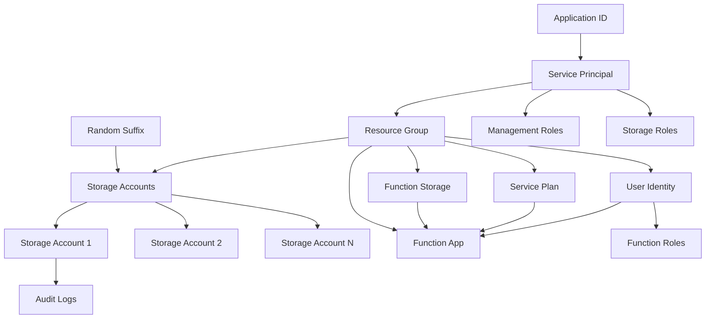

# Terraform Infrastructure Architecture Diagram

This document provides a comprehensive overview of the Azure infrastructure resources created by this Terraform project, including their relationships and multiplicities.

## Architecture Overview

The infrastructure deploys a multi-region Azure log collection system for security monitoring across client organizations.

## Resource Architecture Diagram

## Basic Architecture Diagram



## Alternative ASCII Diagram

```
┌─────────────────────────────────────────────────────────────────┐
│                    TERRAFORM INFRASTRUCTURE                     │
└─────────────────────────────────────────────────────────────────┘

External Dependencies:
┌─────────────────┐    ┌─────────────────┐    ┌─────────────────┐
│  Application    │    │  Random Suffix  │    │  Function ZIP   │
│      ID         │    │   (Uniqueness)  │    │     File        │
└─────────────────┘    └─────────────────┘    └─────────────────┘
         │                       │                       │
         ▼                       ▼                       ▼

Core Infrastructure:
┌─────────────────┐    ┌─────────────────┐    ┌─────────────────┐
│  Service        │    │  Resource       │    │  Function App   │
│  Principal      │    │    Group        │    │  (Python 3.12)  │
└─────────────────┘    └─────────────────┘    └─────────────────┘
         │                       │                       │
         ▼                       ▼                       ▼

Storage (Per Location):                  Function Support:
┌─────────────────┐                     ┌─────────────────┐
│ Storage Acc 1   │                     │ Function Storage│
│   (Location A)  │                     │    Account      │
└─────────────────┘                     └─────────────────┘
┌─────────────────┐                     ┌─────────────────┐
│ Storage Acc 2   │                     │  Service Plan   │
│   (Location B)  │                     │ (ASP-cyngular)  │
└─────────────────┘                     └─────────────────┘
┌─────────────────┐                     ┌─────────────────┐
│ Storage Acc N   │                     │ User Assigned   │
│   (Location N)  │                     │    Identity     │
└─────────────────┘                     └─────────────────┘

Role Assignments:
┌─────────────────────────────────────────────────────────────────┐
│ Management Group Level (8 roles):                               │
│ • Reader                    • Microsoft Sentinel Reader         │
│ • Disk Pool Operator        • API Management Workspace Reader   │
│ • Data Operator for Disks   • Reader and Data Access            │
│ • Disk Snapshot Contributor • Managed App Publisher Operator    │
└─────────────────────────────────────────────────────────────────┘

┌─────────────────────────────────────────────────────────────────┐
│ Storage Account Level (Per SA):                                 │
│ • Storage Account Contributor                                   │
│ • Storage Blob Data Owner                                       │
└─────────────────────────────────────────────────────────────────┘

Optional Components (Conditional):
┌─────────────────┐    ┌─────────────────┐    ┌─────────────────┐
│ Log Analytics   │    │ Application     │    │ AAD Diagnostic  │
│   Workspace     │    │    Insights     │    │    Settings     │
│   (Optional)    │    │   (Optional)    │    │  (Conditional)  │
└─────────────────┘    └─────────────────┘    └─────────────────┘
```

## Key Resource Relationships & Multiplicities

### **Core Infrastructure (1:1)**
- **Resource Group**: Single RG per client deployment (`cyngular-{client_name}-rg`)
- **Service Principal**: One client SP linked to external application ID
- **Random Suffix**: Shared across all storage accounts for uniqueness (ensures globally unique names)

### **Storage Accounts (1:N by locations)**
- **Per Location**: One storage account created for each location in `var.locations`
- **Naming Convention**: `{client_name}{location}{suffix}` (truncated to max 23 characters)
- **Tagging Strategy**: 
  - Main location: Tagged for audit logs (`cyngular-auditlogs`) and activity logs (`cyngular-activitylogs`)
  - Per location: Tagged for NSG flow logs (`cyngular-nsgflowlogs`), AKS logs (`cyngular-aks`), audit events (`cyngular-auditevents`)

### **Role Assignments (N:M)**
- **Management Group Level**: 8 predefined roles assigned to service principal:
  - Reader
  - Disk Pool Operator  
  - Data Operator for Managed Disks
  - Disk Snapshot Contributor
  - Microsoft Sentinel Reader
  - API Management Workspace Reader
  - Reader and Data Access
  - Managed Application Publisher Operator
- **Storage Account Level**: 2 roles per storage account:
  - Storage Account Contributor
  - Storage Blob Data Owner

### **Function Infrastructure (1:1)**
- **Function App**: Single Python 3.12 Linux function app
- **Service Plan**: One consumption/premium plan (`ASP-cyngular-func-{sku}`)
- **Function Storage**: Dedicated storage account for function artifacts (`cyngularfunc{client_name}`)
- **User Assigned Identity**: For function authentication and role assignments

### **Optional/Conditional Resources**
- **Audit Logs Module**: Created only if `enable_audit_logs = true`
  - Creates AAD diagnostic settings for Entra ID audit logs
- **Application Insights + Log Analytics**: Created only if `allow_function_logging = true`
  - Log Analytics Workspace: 30-day retention
  - Application Insights: 60-day retention
- **Diagnostic Settings**: Various conditional resources based on enable_* flags:
  - `enable_activity_logs`: Subscription activity logs
  - `enable_audit_events_logs`: Resource diagnostic settings
  - `enable_flow_logs`: NSG flow logs
  - `enable_aks_logs`: AKS cluster logs

### **Key Dependencies & Flow**
1. **Random Suffix** → Storage Accounts (ensures global uniqueness)
2. **Service Principal** → All Role Assignments (RBAC permissions)
3. **Resource Group** → All Azure Resources (container)
4. **Function ZIP File** → Function Deployment (code artifacts)
5. **Storage Accounts** → Function Environment Variables (log destination configuration)
6. **User Assigned Identity** → Function Role Assignments (secure access to resources)

## Module Structure

### **Root Module** (`Main.tf`)
- Orchestrates all sub-modules
- Manages workspace-specific deployments
- Handles client-specific variable files (`tfvars/{client}.tfvars`)

### **Cyngular Module** (`modules/Cyngular/`)
- Core infrastructure: Resource Group, Service Principal, Storage Accounts
- Multi-location storage deployment with appropriate tagging
- RBAC assignments for storage access

### **Function Module** (`modules/function/`)
- Azure Function App for automated log processing
- Supporting infrastructure: Service Plan, Storage, Identity
- Optional monitoring with Application Insights

### **Role Assignment Module** (`modules/role_assignment/`)
- Management group-scoped role assignments
- Parameterized for different role types
- Used with `for_each` to assign multiple roles

### **Audit Logs Module** (`modules/audit_logs/`)
- Conditional module for Entra ID audit log configuration
- Creates diagnostic settings for AAD logs
- Routes logs to appropriately tagged storage account

## Scaling Characteristics

- **Horizontal Scaling**: Add locations to `var.locations` to create storage accounts in new regions
- **Client Isolation**: Each client deployment uses separate Terraform workspace
- **Feature Toggles**: Enable/disable log types without affecting other components
- **Resource Limits**: Consider Azure limits (5 diagnostic settings per subscription)

## Naming Conventions

| Resource Type | Naming Pattern | Example |
|---------------|----------------|---------|
| Resource Group | `cyngular-{client_name}-rg` | `cyngular-acmecorp-rg` |
| Storage Account | `{client_name}{location}{suffix}` | `acmecorpeastus2abc123` |
| Function App | `cyngular-func-{client_name}-{suffix}` | `cyngular-func-acmecorp-abc123` |
| Service Plan | `ASP-cyngular-func-{sku}` | `ASP-cyngular-func-Y1` |
| Service Principal | External application ID | `12345678-1234-1234-1234-123456789012` |

## Security Model

- **Cross-Tenant Access**: Service principal enables secure cross-tenant resource access
- **Least Privilege**: Role assignments follow principle of least privilege
- **Network Security**: HTTPS-only communication, TLS 1.2 minimum
- **Identity Management**: User Assigned Identity for function app authentication
- **Data Retention**: Configurable blob retention policies (default 90 days)